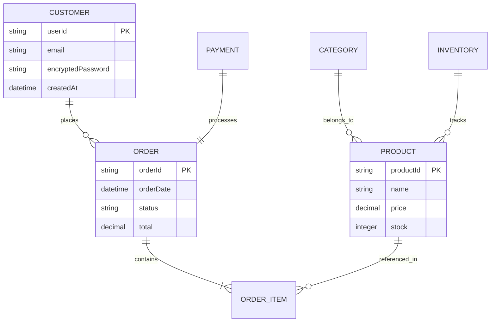

```mermaid
erDiagram
    CUSTOMER ||--o{ ORDER : places
    CUSTOMER {
        string userId PK
        string email
        string encryptedPassword
        datetime createdAt
    }
    ORDER ||--|{ ORDER_ITEM : contains
    ORDER {
        string orderId PK
        datetime orderDate
        string status
        decimal total
    }
    PRODUCT ||--o{ ORDER_ITEM : referenced_in
    PRODUCT {
        string productId PK
        string name
        decimal price
        integer stock
    }
    CATEGORY ||--o{ PRODUCT : belongs_to
    PAYMENT ||--|| ORDER : processes
    INVENTORY ||--o{ PRODUCT : tracks
```