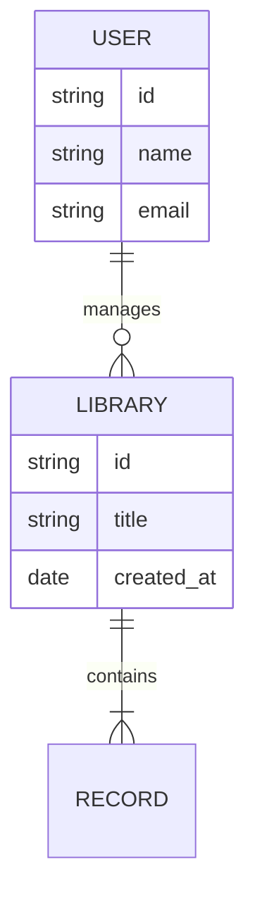
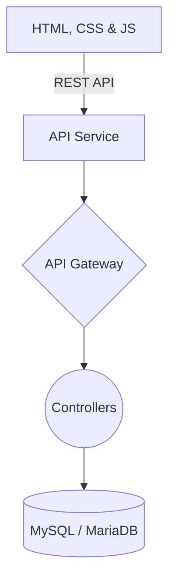

# ONLINE LIBRARY MANAGMENT WEBSITEE...
## Project Details
- Status: Auto-Generated via Antigravity Titan Engine
- Category: GRADUATION
- Backend: Core PHP
- Frontend: HTML, CSS & JS

## Architecture Diagram (Mermaid)

## System Flow (Context DFD)

