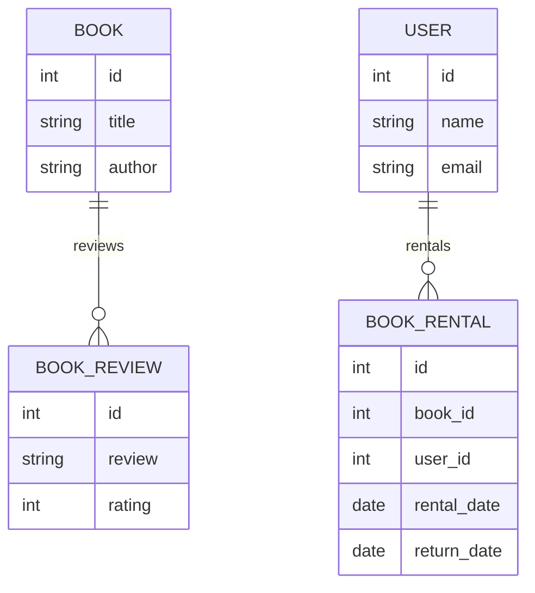

# ONLINE LIBRARY WEBSITE...
## Project Details
- Status: Auto-Generated via Antigravity Titan Engine
- Category: GRADUATION
- Backend: Core PHP
- Frontend: HTML, CSS & JS

## Architecture Diagram (Mermaid)


## System Flow (Context DFD)
```mermaid
graph TD
  A["User"] -->|access|> B["Online Library Website"]
  B -->|request|> C["Database"]
  C -->|response|> B
  B -->|response|> A
```
