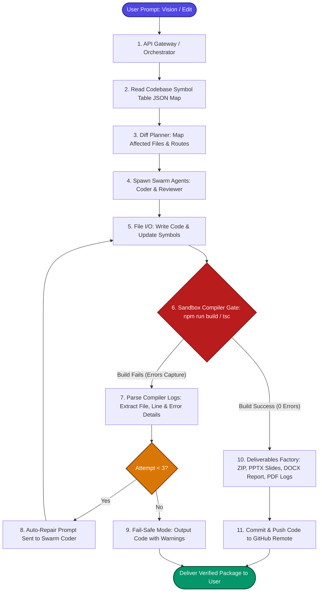
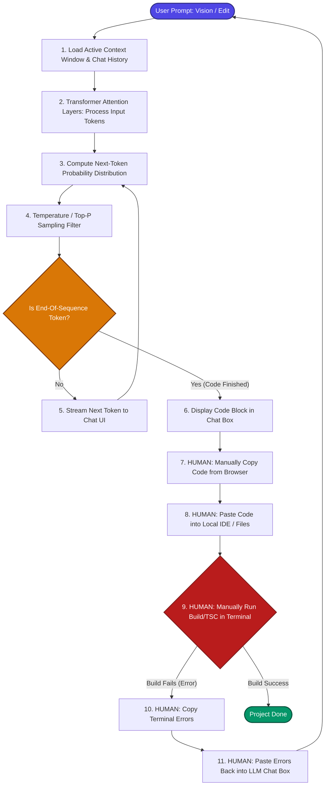

# 🔱 Algorithmic Architecture Diagrams: Future BRTS Builder vs. Standard LLMs
> **Visual Comparison of Autonomous Compilation Loops vs. Autoregressive Token Generation**

This document provides visual flowcharts mapping the exact algorithms of **Future BRTS Builder Chat** and **Standard LLM Chats (ChatGPT, Grok, Claude)**.

---

## 🌀 Diagram 1: Future BRTS Builder Chat Algorithm
> **The Agentic Swarm & Self-Healing Compile Loop (Autonomous & Sandboxed)**

This algorithm manages local file I/O, parses symbols, splits tasks, and runs a self-correction loop with a local compiler.

---

## 💬 Diagram 2: Standard LLM Chat Algorithm
> **Standard Autoregressive Token Inference & Manual Human Debugging Loop**

This algorithm maps the standard conversational next-token prediction loop, which relies on the human developer to compile, test, and copy-paste errors back to the chat.

