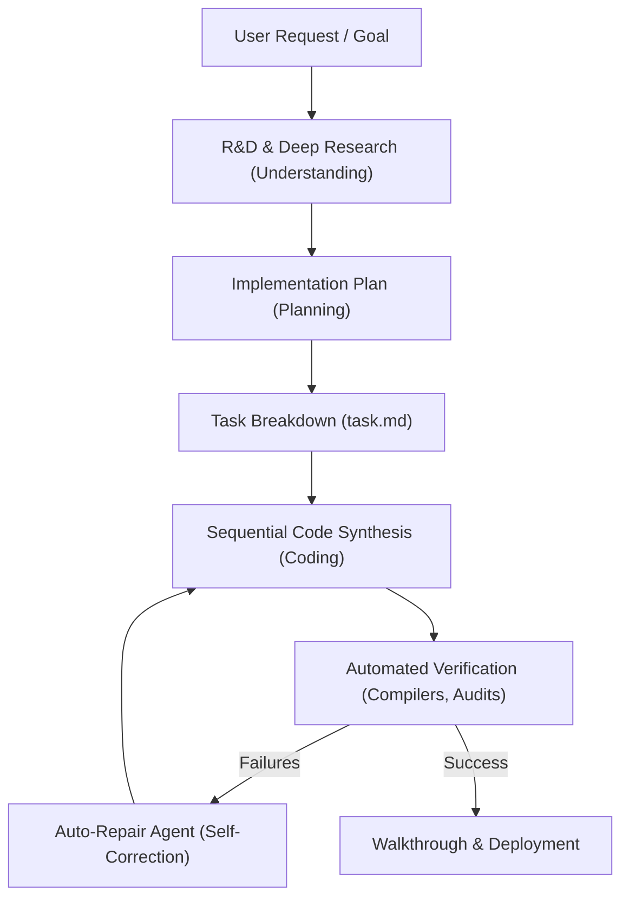

# R&D Report: Upgrading the Collage Project Generator to "Antigravity" Standard

This document details the research and analysis of the **Google Antigravity** agentic philosophy and outlines how we can upgrade the **Collage Project Generator** in our workspace to reach this standard of complete, robust, and high-fidelity code generation.

---

## 🔍 Part 1: How Google Antigravity Works (The Core Agentic Philosophy)

An "Antigravity-class" agentic system is defined by its ability to act as a senior developer pair-programmer. It doesn't just return quick code snippets; it follows a rigorous cycle of **deep understanding, comprehensive planning, production-grade coding, iterative chat updates, and automated verification**.

### 🧠 1. Mind & Reasoning (Deep Understanding)
* **Context Awareness**: Before writing code, the system reads and maps the entire codebase, identifying models, schemas, routers, utility hooks, and CSS styling guidelines.
* **Dependency Mapping**: It understands how components relate. If a page is added, the system knows it must update the router, modify the navigation menu, and declare proper state interfaces.
* **No Assumptions**: If requirements are ambiguous, it pauses to clarify or plans a set of fallback configurations.

### 🛠️ 2. Working & Coding (100% Complete Production Code)
* **Zero Placeholders**: Standard AI models write code templates containing comments like `// TODO: implement logic` or `// ... rest of the code`. An Antigravity system forbids this. Every function, event handler, form validator, database query, and animation is fully written out.
* **High-Fidelity UI**: Interactive features are built to look premium and alive:
  * **Rich Aesthetics**: Deep color schemes (slate/indigo/cyan/violet), glassmorphism (`backdrop-blur`), and border highlights.
  * **Micro-Animations**: Transitions on hover, fade-in entrances via `framer-motion`, and pulsing states.
  * **Dynamic State (CRUD)**: The frontend is not static; it contains full mock databases (local storage simulation) enabling search, sorting, filtering, editing, and pagination immediately.

### 💬 3. Chat & Additional Work (Multi-File Iterative Modifiers)
* **Multi-File Updates**: If a user asks to "add a feature" in the chat interface:
  * **Standard LLM**: Rewrites or creates a single file, leaving links broken elsewhere.
  * **Antigravity Class**: Analyzes the impact across all files. It generates a multi-file plan, updates the main router (`App.tsx`), inserts icons into `Navbar.tsx`, modifies state providers (`AppContext.tsx`), and generates the new component file.
* **Refactoring & Patching**: It edits existing code cleanly without stripping out other user logic or unrelated comments.

### 🛡️ 4. Verification & Self-Correction (Code Integrity)
* **Static Verification**: Validates parenthesis/bracket balancing, checks for illegal HTML templates in React files, and verifies imports.
* **Linter & Compiler Checks**: Runs build scripts (`npm run build`) to catch TypeScript compiler warnings or missing import statements before completing the work.
* **Auto-Repair Agent**: If a compile check fails, the logs are fed back into the AI to automatically fix imports, types, or syntax errors.

---

## 📊 Part 2: Current Collage Project Generator Analysis

The current Collage Project Generator is handled by:
* [multi_agent.service.ts](file:///c:/Users/Admin/.gemini/antigravity/futurebuilderlatest%20grok%20last/futurebuilderlatest/project/backend/api_gateway/src/modules/collage_project/multi_agent.service.ts) (API gateway orchestration)
* [source_code_generator.py](file:///c:/Users/Admin/.gemini/antigravity/futurebuilderlatest%20grok%20last/futurebuilderlatest/project/worker/generators/source_code_generator.py) (Python worker generator)

### Current Limitations vs. Antigravity Standard:

| Feature | Current Implementation | Antigravity Standard (Target) |
|---|---|---|
| **Code Completeness** | Uses basic validation regexes to block `// TODO`, but LLMs still generate short/empty layouts with minimal functional inputs. | Generates rich, highly detailed forms, detailed mock databases, full analytics graphs, and fully realized CRUD handlers. |
| **Chat Iterations** | `handleChatUpdate` only generates or updates a **single** target file. | A **Diff Planner** maps the changes to all affected files (e.g. Navigation, App, Context) and edits them collectively. |
| **Component Layouts** | Layout components are generic and repeated across different project types. | High-fidelity, domain-specific pages (e.g. a hospital project gets appointment calendars; an ecommerce gets product grids and cart sidebars). |
| **Verification & Repair** | Has a basic syntax check and symbol table, but does not run live compiler tests or auto-repair files when build errors occur. | Integrates build checking and self-repair loops for generated workspaces. |

---

## 🗺️ Part 3: Discussion & Upgrade Strategy

To make the Collage Project frontend generator 100% complete and fully working, we should discuss the following three major enhancements:

### 1. Advanced Chat Iteration (Multi-File Diff Engine)
Update the backend chat handler (`handleChatUpdate`) to use a **Multi-File Planner**:
1. When the user asks for changes via chat (e.g. *"add a payment page with invoice generation"*), the planner generates a file diff plan.
2. The orchestrator updates `App.tsx` (adds the route), `Navigation.tsx` (adds the menu item), `AppContext.tsx` (adds cart/payment state), and creates `PaymentPage.tsx` with full interactive invoice forms and local storage data persistence.

### 2. High-Fidelity Domain Blueprint Templates
Create a rich catalog of frontend template presets inside `multi_agent.service.ts` or `source_code_generator.py` tailored to different project domains:
* **E-Commerce**: Product filters, shopping cart slide-overs, checkouts, reviews.
* **School/College Portal**: Student dashboards, grade tables, exam generators, scheduling calendars.
* **Hospital/Medical**: Patient records, appointment booking calendars, doctors' schedules.
* **Real Estate**: Property listings, interactive pricing filters, maps, booking tours.

### 3. Verification & Build-Checking Gate
Deploy a validation runner that:
1. Automatically unpacks the generated codebase into a temporary directory.
2. Runs `npm run build` or `vite build` to verify compiling.
3. Feeds any TypeScript or bundler errors back to the AI for self-correction before packaging the final ZIP.

---

## 💬 Next Steps for Discussion
Before making any codebase modifications, let's align on:
1. Should we focus the upgrades entirely on the **React/TSX frontend prototype engine** first, or do we want full-stack integration (React + Express Node.js + Mongoose)?
2. Do you want to see the **Multi-File Chat Planner** implemented so that you can dynamically grow your generated project page-by-page through the project chat interface?
3. How deep do you want the compilation/lint check to go during code generation?
