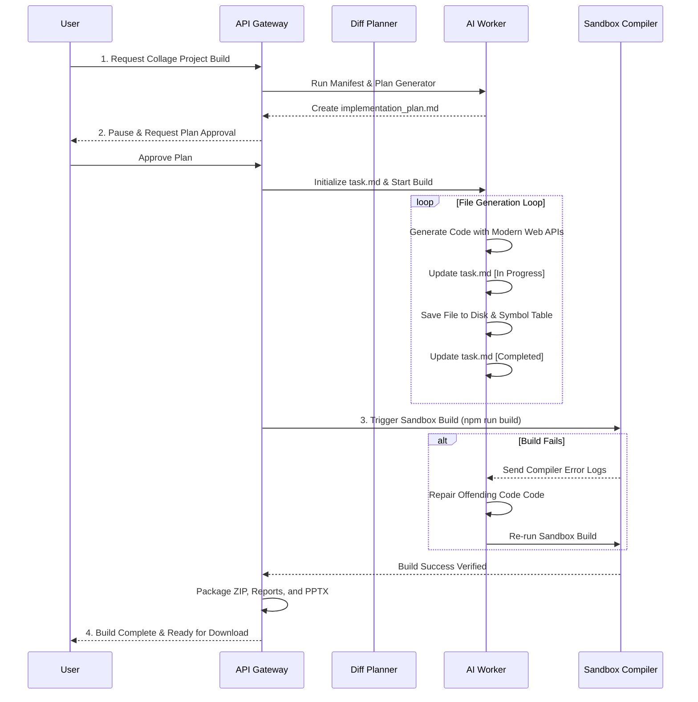
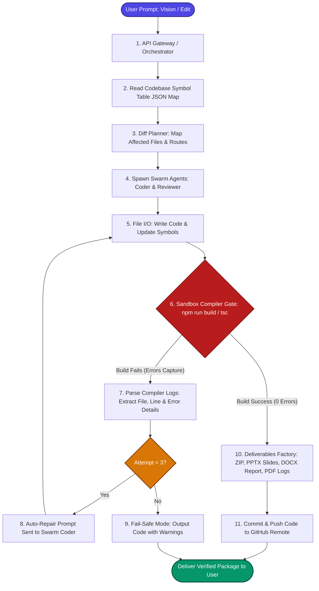
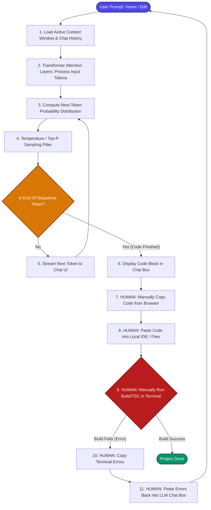

# 🔱 Google Antigravity Agent: Complete System Architecture and Web Engineering Master Specification

This document serves as the final, unified master specification for the **Google Antigravity Agentic IDE & Web Engineering Architecture**. It combines global agentic design, UI panels, cognitive loops, development and deployment engines, verification gates, and the official Google Chrome modern web platform APIs.

---

## 🖥️ Chapter 1: The Unified Agentic Workspace (IDE & UI Micro-Phases)

The Antigravity workspace unifies chat interfaces, project directories, shell execution states, and custom compiler feedback.

```
+--------------------------------------------------------------------------------+
|  MENU BAR (File, Edit, Workspace, Plugins, Agent Mode, Developer Console)       |
+--------------------------------------------------------------------------------+
|  TOOLBAR: [Slash Commands Command Palette: /goal, /browser, /grill-me, /learn]  |
+--------------------------------------------------------------------------------+
|  SIDEBAR           |  ACTIVE EDITOR PANEL                   |  CHAT PANEL      |
|  - File Explorer   |  - [App.tsx]                           |  - Agent Bubble  |
|  - Skill Registry  |  - Code lines with cursor tracking     |  - Ask Question  |
|  - Subagents Swarm |  - Active symbols list                 |  - Permissions   |
|  - Task Tracker    |                                        |  - Logs/Timeline |
|                    +----------------------------------------+------------------+
|                    |  TERMINAL / DAEMON MONITOR (Ports)                        |
|                    |  - API Gateway [7001] | - Vite UI [5173]                  |
+--------------------+-----------------------------------------------------------+
```

### 1. The Toolbar (Command Palette & Slash Commands)
The Command Palette at the top of the interface processes high-level autonomous tasks via **Slash Commands**:
* **`/goal` (Autopilot Mode)**: Triggers autonomous execution. The agent iterates through research, code edits, and compiler tests in a closed loop until the goal is achieved.
* **`/browser` (Web Scraper)**: Opens a headless chromium viewport, enabling the agent to crawl documentation sites, search search engines, and read URL contents dynamically.
* **`/grill-me` (Design Alignment)**: Initiates an interactive interview modal to gather project constraints (color palettes, pages, API structures) before writing code.
* **`/teamwork-preview` (Swarm visualizer)**: Displays a graph showing how task workloads will be distributed among spawned subagents.
* **`/learn` (Memory Anchor)**: Writes persistent styling/developer guidelines to the global `AGENTS.md` file.

### 2. The Menu Bar (Context Control)
Manages workspace states and developer tools:
* **Workspace Mode Selection**: Toggle between **Planning Mode** (safe research, plan writing) and **Execution Mode** (code modification, command execution).
* **Developer Console**: Real-time daemon monitoring (process states, log outputs, and network port bindings).
* **Active Transcripts Viewer**: Exposes links to `transcript.jsonl` (compact JSON traces) and `transcript_full.jsonl` (raw inputs/outputs).

### 3. The Sidebar (Operational Registry)
Provides navigation and state feedback:
* **Active File Explorer**: Standard workspace file tree.
* **Skill Registry**: Registry of discovered plugins and skill folders (containing `SKILL.md` documents, helper scripts, and assets).
* **Active Agent Swarm**: List of active subagents, their running tasks, and workspace isolation types.
* **Task Tracker Panel**: Reads `task.md` directly and renders a checklist (Pending `[ ]`, In Progress `[/]`, Completed `[x]`).

---

## 🧠 Chapter 2: Cognitive Mind, Context, & Customization

The cognitive core processes user intent, retrieves project metadata, and manages symbolic relationships.

```
       +-------------------------------------------------------+
       |                  USER PROMPT / TARGET                 |
       +----------------------------+--------------------------+
                                    |
                                    v
       +----------------------------+--------------------------+
       |   CONTEXT ENGINE (Editor states, Cursors, File tree)  |
       +----------------------------+--------------------------+
                                    |
                                    v
       +----------------------------+--------------------------+
       |  CUSTOMIZATIONS:                                      |
       |  - Global: C:\Users\Admin\.gemini\config\AGENTS.md    |
       |  - Project: workspace/.agents/skills/                 |
       +----------------------------+--------------------------+
                                    |
                                    v
       +----------------------------+--------------------------+
       |   SEMANTIC RESOLUTION (Symbol Table, Types, Imports)  |
       +-------------------------------------------------------+
```

### 1. The Context Engine
With every interaction, the agent receives structural metadata representing the developer's active state:
* **Active Editor File**: Absolute file path of the currently focused editor.
* **Cursor Coordinates**: Line and column number indicating the user's cursor focus.
* **Selection State**: Text highlighted in the active window.
* **Workspace Manifest**: Available microservices, configuration scripts, and package dependency trees.

### 2. Customizations & Skill Loader
The agent automatically scans and loads styling rules and capabilities:
* **Global Rules**: Universal developer preferences inside `C:\Users\Admin\.gemini\config\AGENTS.md`.
* **Project Rules**: Workspace constraints inside `[WorkspaceRoot]/.agents/AGENTS.md`.
* **Skills Loader**: Scans custom directories to load matching `SKILL.md` instructions and scripts.

### 3. The Symbol Table & Semantic Map
* Analyzes target files to extract code symbols: Models, Controller functions, Router paths, and React Exports.
* These are saved to a **Symbol Table** (structured JSON map).
* On subsequent file generations, the agent retrieves this map to compute correct relative import paths and verify variable name synchronization.

---

## 🛠️ Chapter 3: The Develop System (Planning, Coding, & Auto-Stitch)

This engine handles the planning, writing, and refactoring of source code.

### 1. Research Phase
* In Planning Mode, the agent uses read-only tools:
  * `list_dir` to map directories.
  * `grep_search` to find symbols, configs, or variables.
  * `view_file` to read specific line ranges.
* **Constraint**: Any write or modification command will be blocked.

### 2. The Implementation Plan (`implementation_plan.md`)
* The agent generates a structured plan detailing:
  * **User Review Required**: Key architectural design decisions and color systems.
  * **Open Questions**: Clarifying questions for the user.
  * **Proposed Changes**: Files to write/modify/delete, demarcated with `[NEW]`, `[MODIFY]`, or `[DELETE]`.
  * **Verification Plan**: Build commands and automated tests to run.
* Written to `brain/<conversation-id>/implementation_plan.md` for user approval before starting execution.

### 3. The Task Board (`task.md`)
* Once the plan is approved, the agent initializes the `task.md` TODO list.
* Items are updated sequentially: Pending `[ ]` ➔ In Progress `[/]` ➔ Completed `[x]`.

### 4. Code Synthesis Mechanics
* Files are created or edited using specific tools:
  * `write_to_file`: Creates new files.
  * `replace_file_content`: Replaces a single contiguous block of code.
  * `multi_replace_file_content`: Replaces multiple non-contiguous blocks simultaneously.
* **Fidelity & Quality Rules**:
  * **No Placeholders**: Never outputs `// TODO` or `...`.
  * **Auto-Stitching**: If the LLM response cuts off mid-generation due to token limits, the agent detects the truncation (e.g. unclosed braces) and fires a continuation prompt (`"Continue writing the code exactly from this snippet..."`) to join the code blocks.
  * **Name Collision Prevention**: Prevents naming local components the same as Lucide icons (e.g. using `SettingsPage` to avoid conflict with `<Settings />`).

---

## 🛡️ Chapter 4: The Verification & Auto-Repair Gate

The verification system ensures code compiles successfully before concluding tasks.

```
       +-------------------------------------------------------+
       |                SYNTAX SANITY FILTER                   |
       |  - Balance check: { }, [ ], ( )                       |
       |  - No raw HTML wrapper tags in React/JS               |
       |  - No obsolete React Router v5 syntax                 |
       +----------------------------+--------------------------+
                                    |
                                    v
       +----------------------------+--------------------------+
       |              SANDBOXED COMPILATION GATE               |
       |  - Executes `npm run build` or `vite build`            |
       |  - Collects stdout and stderr                         |
       +----------------------------+--------------------------+
                                    |
                                    v
       +----------------------------+--------------------------+
       |                 SELF-CORRECTION LOOP                  |
       |  - Feed compilation errors back to AI                 |
       |  - Refactor offending file                            |
       |  - Re-run compiler (up to 3 times)                    |
       +-------------------------------------------------------+
```

### 1. Syntax Sanity Filter
Validates files against structural rules before committing:
* **Bracket Balancing**: Verifies that `{ }`, `( )`, and `[ ]` are mathematically balanced.
* **HTML Wrapper Block**: Prevents writing raw HTML pages inside React modules.
* **Router Validation**: Restricts obsolete React Router v5 syntax (e.g., using `<Switch>` instead of `<Routes>`).
* **Import Verification**: Verifies all used JSX components are imported.

### 2. Sandboxed Compilation Gate
* Runs the project's build scripts (`npm run build` or `tsc --noEmit`) in the background.
* Captures the full compiler output logs.

### 3. Self-Correction Loop
* If the compilation fails, the agent parses the logs to extract the file, line number, and error details.
* Feeds this back to the AI: *"File <file> failed compilation with error <error>. Rewrite to fix this error."*
* The agent writes the fix and re-compiles, repeating up to 3 times.

---

## 💬 Chapter 5: Swarm Intelligence & Subagent Collaboration

For complex projects, the main agent orchestrates specialized subagents.

```
                  +--------------------------------+
                  |           MAIN AGENT           |
                  +---------------+----------------+
                                  |
            +---------------------+---------------------+
            |                     |                     |
            v                     v                     v
    +---------------+     +---------------+     +---------------+
    |  RESEARCHER   |     |   DB DESIGNER |     |  UI BUILDER   |
    | (Read-Only)   |     |  (Write/Cmd)  |     |  (Write/Cmd)  |
    +-------+-------+     +-------+-------+     +-------+-------+
            |                     |                     |
            +---------------------+---------------------+
                                  |
                                  v
                  +---------------+----------------+
                  |    SHARED / BRANCHED REPOS     |
                  +--------------------------------+
```

### 1. Subagent Spawning
* **`define_subagent`**: Creates custom templates defining roles, tools, and custom system prompts.
* **`invoke_subagent`**: Launches one or more subagents concurrently to handle tasks.

### 2. Workspace Isolation Modes
* **`inherit`**: Subagent works in the parent's directory.
* **`branch`**: Creates an isolated clone of the directory for the subagent.
* **`share`**: Creates a shared Git worktree, allowing the subagent to work on an independent branch without duplicating files.

### 3. Inter-Agent Communication (`send_message`)
* Agents pass details asynchronously using the `send_message` tool.
* Subagents notify the parent on completion, sending file lists and test logs.

---

## 🌐 Chapter 6: Modern Web Guidance Specifications (Chrome/Edge Standards)

The actual Google Antigravity coding guidelines prioritize modern, lightweight native browser APIs, replacing legacy JavaScript workarounds with zero-dependency browser features.

### 1. User Interface & Overlay Elements

#### A. Native Popovers (Popover API)
* **Standard**: Leverage the native `popover` attribute to create menus, overlays, and dropdowns. This eliminates the need to track React state triggers and absolute coordinates manually:
  ```html
  <button popovertarget="my-menu">Open Menu</button>
  <div id="my-menu" popover>
     <p>Native Light Dismiss and Top-Layer rendering handled by the browser.</p>
  </div>
  ```

#### B. Native Dialogs (`<dialog>` Element)
* **Standard**: Use `<dialog>` for modal popups and alerts, leveraging native focus-trapping and `Escape` key close handlers:
  ```html
  <dialog id="modal-box">
     <form method="dialog">
        <p>Interactive modal with native backdrop blur styling.</p>
        <button>Close</button>
     </form>
  </dialog>
  ```

#### C. CSS Anchor Positioning
* **Standard**: Absolute-anchor tooltips, menus, and badges relative to their triggers in CSS without JavaScript positioning calculation scripts:
  ```css
  .tooltip {
     position: absolute;
     position-anchor: --my-trigger;
     top: anchor(bottom);
     left: anchor(center);
  }
  ```

### 2. High-Performance Styling & Animations

#### A. CSS `@starting-style` (Discrete Transitions)
* **Standard**: Transition entrance animations for elements going from `display: none` to `display: block` directly in CSS:
  ```css
  .overlay {
     transition: opacity 0.4s, display 0.4s allow-discrete;
     opacity: 1;
     display: block;
  }
  @starting-style {
     .overlay {
        opacity: 0;
     }
  }
  ```

#### B. CSS `field-sizing: content` (Auto-Resizing Inputs)
* **Standard**: Create textareas that automatically resize to fit text without scrollHeight event listeners:
  ```css
  textarea {
     field-sizing: content;
     min-height: 2lh;
     max-height: 8lh;
  }
  ```

### 3. Accessible Forms & Validation

#### A. Native Interaction Validation (`:user-invalid`)
* **Standard**: Style invalid inputs only *after* user interaction to prevent immediate error styling on page load:
  ```css
  input:user-invalid {
     border-color: var(--error);
     box-shadow: 0 0 4px var(--error-glow);
  }
  ```

### 4. SPA Performance & Transitions

#### A. View Transitions API (Fluid Routing)
* **Standard**: Enable visual morphs and smooth transitions on route changes natively:
  ```javascript
  document.startViewTransition(() => {
     updateRouterState();
  });
  ```

#### B. Long Tasks Yielding (`scheduler.yield()`)
* **Standard**: Break up heavy data calculations to maintain page responsiveness (reducing INP latency):
  ```javascript
  async function parseMetrics() {
     for (let chunk of datasets) {
        processChunk(chunk);
        await scheduler.yield();
     }
  }
  ```

---

## 💾 Chapter 7: Save, Persistence, & Version Control (State Capture)

Tracks, records, and preserves all workspace changes.

### 1. Chronological Logs (Transcripts)
* **`transcript.jsonl`**: A compact, token-efficient trace of all steps. Used to audit inputs and tool triggers.
* **`transcript_full.jsonl`**: The raw, complete record of the conversation, keeping code blocks intact.

### 2. The Artifacts Directory
Located under `brain/<conversation-id>/`:
* Contains plans, checklists, and walkthroughs.
* **`/scratch`**: Folder for debugger scripts or temporary data files.
* **`/versions`**: Archives historical project packaging iterations.

---

## 🚀 Chapter 8: Deployment & Integration (Deploy System)

Manages background service status and packages deliverables.

### 1. Daemon Management
* Detaches long-running commands (databases, dev servers, worker runtimes) in the background.
* Monitors task states using `manage_task` with actions like `status` and `kill`.

### 2. Export Factory
Generates deliverables at the end of the project:
* **Academic Report**: Generates `project-report.docx` documenting the architecture, database models, and design points.
* **Pitch Deck**: Generates `presentation.pptx` with slides explaining the business model and modules.
* **Test Case Report**: Generates `test-report.pdf` detailing the unit tests.
* **Project Archive**: Compiles all source files into a ZIP archive, excluding databases and packages.
* **Remote Publishing**: Syncs with git remote repositories and pushes changes using the user's PAT.

---

## 🗺️ Chapter 9: Gap Analysis & Collage Project Generator Upgrade Roadmap

Here is the direct comparison between our current project generator and the target **Google Antigravity Master Standard**, along with the roadmap for the upgrade.

### 1. Comparison Matrix

| Operational Phase | Current Generator Implementation | Target Antigravity Standard |
| --- | --- | --- |
| **Planning & Manifest** | Extracts file paths and starts code generation immediately. | Creates `implementation_plan.md`, details modifications, lists open questions, and blocks execution until user approves. |
| **Checklist Management** | Uses basic task records in the DB, but has no live checklist file. | Writes a live `task.md` file in the project workspace, updating task states (`[ ]` ➔ `[/]` ➔ `[x]`) in real time. |
| **Code Completeness** | Hardcodes templates (`source_code_generator.py`) and generates basic pages with mock comments. | Enforces zero placeholders. Pages are fully styled, and forms have actual validation and localStorage CRUD. |
| **Verification & Repair** | Basic brackets and syntax verification checks, but no compiler execution. | Runs a sandbox compile check (`npm run build`). Captures errors and feeds them to an auto-repair agent to resolve issues. |
| **Chat updates** | Chat updates only edit a single target file, resulting in broken routes and navigation. | An AI Diff Planner maps changes to all affected files, editing App router, Navigation sidebar, and components together. |
| **Modern Web APIs** | Uses legacy CSS custom rules, custom JS event listeners for popup close, and React state validation. | Integrates native `<dialog>`, `Popover API`, `@starting-style` transitions, `field-sizing: content`, and `:user-invalid` validation. |

### 2. Implementation Roadmap



---

## 🔱 Chapter 10: Future BRTS Builder LLM Pipeline vs. Standard LLMs

Below is the detailed comparative analysis of the **Future BRTS Builder LLM Pipeline** compared to standard LLM Chat interfaces (such as ChatGPT, Claude, and Grok) when executing application development workflows.

### 1. Algorithmic Workflow & Execution Differences

#### A. Future BRTS Builder Swarm & Self-Healing Compile Loop (Autonomous & Sandboxed)
The Future BRTS Builder Chat integrates local workspace awareness, parses files into symbol tables, drafts diff plans across multiple files, and compiles the code in a sandbox, automatically fixing bugs.



#### B. Standard LLM Chat Algorithm (Standard Token Inference & Manual Human Debugging Loop)
Standard LLMs stream raw text tokens to the UI based on autoregressive probabilities. The human developer is required to manually act as the compiler, running the build, identifying bugs, and copy-pasting code/errors.



---

## 📄 Chapter 11: Non-Code Document & Presentation Synthesis Engine

Beyond code generation, Future BRTS Builder integrates advanced engines to synthesize non-code project deliverables dynamically based on the project's semantic context.

### 1. Microsoft Word Report Generator (`.docx`)
* **Algorithm**:
  1. **Content Schema Engine**: Scans the project scope, technologies, and Database configurations to outline Chapter structures (Abstract, Requirements, Database Schema Tables, System Flow).
  2. **File Assembly Driver**: Converts markdown segments into a formatted Office Open XML document structure (`.docx`) with a Title Page, styled Tables of Contents, header-footer numbers, and custom styling.
* **LLM Chat Comparison**: Standard LLMs can only generate raw Markdown text in the chat box, which the user must copy, format, and organize in Word manually.

### 2. PowerPoint Slide Synthesizer (`.pptx`)
* **Algorithm**:
  1. **Slide Splitting Logic**: Divides the project overview, modules, architectural blueprints, and unique features into 6-10 slides.
  2. **XML Presentation Assembly**: Compiles slide properties into structured XML layers, applies a standardized color template (e.g. Indigo-Dark theme), and writes the presentation directly to a `.pptx` file.
* **LLM Chat Comparison**: Standard LLMs can output slide outlines as text but cannot write a structured, formatted `.pptx` presentation.

### 3. Visual Diagram Compiler (Mermaid to PNG/SVG)
* **Algorithm**:
  1. **Syntax Generator**: Compiles project database schemas into Mermaid `erDiagram` syntax and system flows into `graph TD` structures.
  2. **Diagram Render Engine**: Automatically renders the Mermaid syntax into raw visual graphics (PNG or SVG) in the background.
  3. **Auto-Embedding**: Embeds the rendered image files directly in the Word Report and saves them to the workspace asset folder.
* **LLM Chat Comparison**: Standard LLMs output raw Mermaid syntax text which the user must manually copy and paste into third-party visualizers.

### 4. MCQ & Mock Viva Engine (Student/Review Prep)
* **Algorithm**:
  1. **Topic Analysis**: Evaluates technologies used (e.g., Next.js, Express, MongoDB).
  2. **Evaluation Builder**: Dynamically generates 10 MCQs and 10 Viva questions with answers based on the generated architecture.
  3. **Task Board Registration**: Registers questions within the workspace to prepare the user for project reviews.

### 5. Vector RAG Knowledge Base Retrieval
* **Algorithm**:
  * Semantic query parsing over a local vector database of academic papers, technology manuals, and business blueprints to inject precise, context-rich references and literature reviews into the reports.

---

## 🚀 Chapter 12: Platform Improvements & Upgrade Roadmap

To establish market leadership over other visual and AI code generators, the following upgrades should be implemented:

### 1. Live Sandbox Preview (WebContainers)
* **Upgrade**: Run full frontend previews in the browser using Vercel's WebContainers or WebAssembly-based runners.
* **Impact**: Eliminates the need to download the ZIP file to view the application; users can interact with the live layout on their dashboard.

### 2. Caching & Symlink Optimization (Speed)
* **Upgrade**: Implement PNPM global package caching or local symlink cache to share `node_modules` across all generated projects.
* **Impact**: Speeds up compilation and repair verification checks from 2 minutes to less than 15 seconds.

### 3. Active Mock API Server (MSW / SQLite)
* **Upgrade**: Replace backend comments with an active mock server using SQLite or Mock Service Worker (MSW).
* **Impact**: The generated frontend is fully operational with mock CRUD requests saved to a mock API out-of-the-box.

### 4. Hybrid Visual Design Canvas
* **Upgrade**: Add a visual low-code editor panel next to the chat interface.
* **Impact**: Allows users to visually click, rearrange elements, edit text, and change color themes while compiling code modifications in the background.

### 5. Visual Git Versioning Timeline
* **Upgrade**: Renders a commit history timeline directly in the UI dashboard.
* **Impact**: Allows the user to inspect code changes between versions and easily revert or rollback to older builds.
